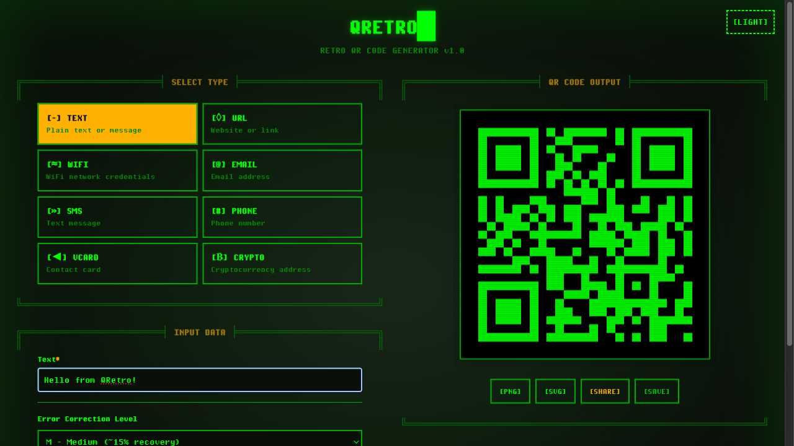
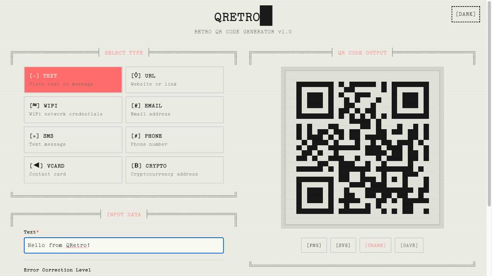
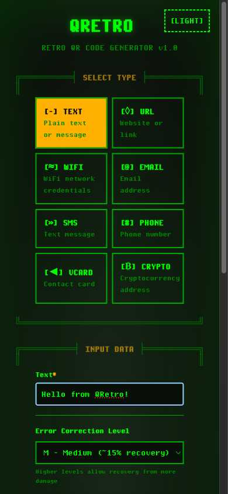
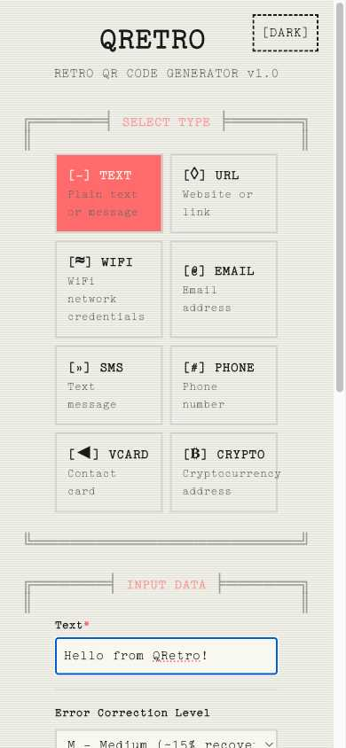

# QRetro 🖥️

A retro-styled QR code generator with a terminal aesthetic. Generate QR codes for text, URLs, WiFi credentials, and more with a nostalgic interface reminiscent of old terminals and Minitel systems.

🌐 **Live App**: [https://slopsauce.github.io/QRetro](https://slopsauce.github.io/QRetro)


## Screenshots

<div align="center">
  
  <br>
  <em>Dark theme with classic terminal aesthetics</em>
  <br><br>
  
  <br>
  <em>Light theme with typewriter aesthetics</em>
  <br><br>
  <div>
    
    
  </div>
  <em>Responsive mobile design in both themes</em>
</div>

## Features

- 🎨 **Retro Terminal UI** - Clean borders, authentic phosphor green/amber colors with CRT scanlines
- 🌓 **Dual Theme Fonts** - PixelOperatorMonoHB terminal font (dark) & TT2020Base typewriter font (light)  
- 📱 **Multiple QR Types** - Text, URL, WiFi, vCard, SMS, Email, and more
- ⚙️ **Error Correction** - Configurable redundancy levels (L/M/Q/H)
- 💾 **Download Options** - Save as PNG or SVG formats
- 🔗 **Shareable Links** - Generate permanent URLs for your QR codes
- 📱 **PWA Support** - Install as a standalone app on your device
- ⚡ **Fast & Free** - No authentication required, instant generation
- 📺 **CRT Effects** - Subtle monitor glow and horizontal scanlines for authentic retro feel

## Getting Started

### Prerequisites

- Node.js 18+ 
- npm or yarn

### Installation

1. Clone the repository:
```bash
git clone https://github.com/slopsauce/QRetro.git
cd QRetro
```

2. Install dependencies:
```bash
npm install
```

3. Run the development server:
```bash
npm run dev
```

4. Open [http://localhost:3000](http://localhost:3000) in your browser

## Usage

1. Select the type of QR code you want to generate
2. Enter your data (text, URL, WiFi credentials, etc.)
3. Customize the appearance (optional)
4. Generate and download your QR code

## PWA Installation

QRetro can be installed as a Progressive Web App for quick access:

### Desktop (Chrome/Edge)
1. Visit [https://slopsauce.github.io/QRetro](https://slopsauce.github.io/QRetro)
2. Click the install icon in the address bar (usually a ⊕ or computer icon)
3. Click "Install" in the popup

### Mobile (iOS)
1. Open Safari and visit the app
2. Tap the Share button (square with arrow)
3. Scroll down and tap "Add to Home Screen"
4. Tap "Add"

### Mobile (Android)
1. Open Chrome and visit the app
2. Tap the menu (three dots)
3. Tap "Add to Home screen" or "Install app"
4. Tap "Install"

Once installed, QRetro will appear as an app icon on your device and can be launched like any other application.

## Development

```bash
# Run development server
npm run dev

# Build for production
npm run build

# Start production server
npm start

# Run linting
npm run lint
```

## Deployment

This project is automatically deployed to GitHub Pages on every push to the main branch.

### Automated Maintenance

- **CI/CD**: GitHub Actions runs build and lint checks on all pull requests
- **Dependencies**: Dependabot automatically updates npm packages weekly
- **Quality**: All changes must pass CI before merging

## Tech Stack

- **Framework**: Next.js 15+ with TypeScript
- **Styling**: Tailwind CSS with custom retro fonts
- **QR Generation**: qrcode.js
- **Theming**: next-themes with dual font system
- **Fonts**: PixelOperatorMonoHB (terminal) & TT2020Base (typewriter)
- **CI/CD**: GitHub Actions with automated dependency updates
- **Deployment**: GitHub Pages

## Contributing

Contributions are welcome! Please feel free to submit a Pull Request.

1. Fork the project
2. Create your feature branch (`git checkout -b feature/AmazingFeature`)
3. Commit your changes (`git commit -m 'Add some AmazingFeature'`)
4. Push to the branch (`git push origin feature/AmazingFeature`)
5. Open a Pull Request

## License

This project is licensed under the MIT License - see the [LICENSE](LICENSE) file for details.

## Acknowledgments

- Inspired by classic terminal interfaces and retro computing aesthetics
- Built with love for the retro computing community

---

Made with 💚 by [claude-code](https://github.com/anthropics/claude-code)